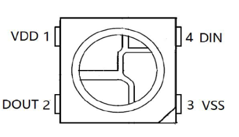
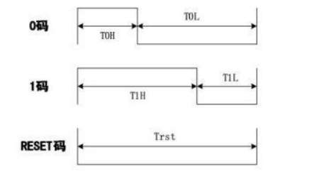
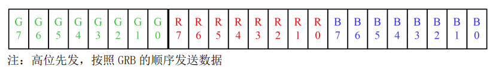

# WS2812

## 引脚

| **symbol** | **描述**                            |
| ---------- | ----------------------------------- |
| **VDD**    | **电源 3.5V到5.3V**                 |
| **DOUT**   | **控制信号的输出**                  |
| **DIN**    | **控制信号的输入 -0.5V 到VDD+0.5V** |
| **VSS**    | **地**                              |

## 时序

LED 灯珠主要根据高电平时间判断“0”码和“1”码。高电平时间介于 200ns\~410ns,IC 判断为“0”码,高电平时间介于 640ns\~1000ns,判断为“1”码。 “0”码和“1”码的低电平代表此码结束，准备接收下一数据码。

## 24bit 数据结构

## TODO

- 双指针

